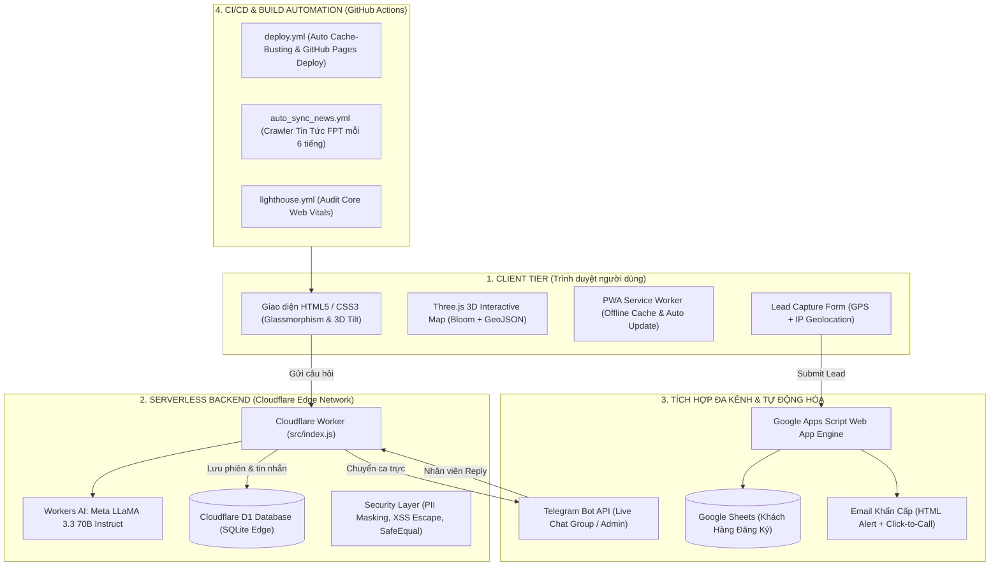

# 📑 BÁO CÁO TỔNG QUAN VÀ CHI TIẾT DỰ ÁN FPT TELECOM

---

## I. TỔNG QUAN DỰ ÁN (EXECUTIVE SUMMARY)

* **Tên dự án:** FPT Telecom Portal & Hybrid AI Customer Assistant (`fpt-telecom-site`)
* **Tên miền hoạt động (Production Domain):** [https://fpttelecomvn.click](https://fpttelecomvn.click)
* **Tác giả / Quản trị viên:** Trần Văn Mẫn (ManHenry)
* **Email liên hệ:** `tvm19624@gmail.com` | `mantv2@fpt.com`
* **Hotline hỗ trợ:** `0383 900 321` – `0358 513 269`
* **Mục tiêu hệ thống:**
  1. Cung cấp cổng thông tin tra cứu bảng giá, khuyến mãi lắp đặt Internet cáp quang (WiFi 6 / WiFi 7 SpeedX), Truyền hình FPT Play, FPT Camera AI và FPT Smart Home trên toàn quốc.
  2. Hệ thống chăm sóc khách hàng thông minh **Hybrid AI**: Tự động tư vấn báo giá chính xác theo từng vùng miền (LLaMA 3.3 70B) và hỗ trợ chuyển tiếp Live Chat trực tiếp với chuyên viên qua Telegram.
  3. Thu thập, định vị GPS/IP và chuyển giao khách hàng tiềm năng (Lead) tức thì về **Google Sheets** và **Email** trong vòng 3 giây.
  4. Tự động hóa cập nhật tin tức từ cổng chính hãng `fpt.vn` thông qua GitHub Actions Cron Job.
  5. Tự động hóa quy trình Build, Cache-Busting theo mã commit Git và Deploy lên GitHub Pages.

---

## II. KIẾN TRÚC HỆ THỐNG (SYSTEM ARCHITECTURE)

Hệ thống được thiết kế theo mô hình **Jamstack + Serverless Edge Architecture**, loại bỏ hoàn toàn chi phí duy trì máy chủ vật lý, tối ưu độ trễ (latency < 50ms) và đảm bảo tính sẵn sàng 99.99%.



---

## III. CÔNG NGHỆ VÀ THƯ VIỆN ĐANG ÁP DỤNG (TECH STACK & LIBRARIES)

### 1. Frontend & Client-Side Technologies
* **Ngôn ngữ cốt lõi:** HTML5 Semantic, Vanilla CSS3 (Custom Variables, Flexbox/Grid, 3D Transforms), Vanilla JavaScript (ES6+ Module).
* **Đồ họa 3D & Bản đồ tương tác (3D WebGL):**
  * `three.js` (v0.160.0) tải động qua `importmap` và dynamic import:
    * `OrbitControls`: Điều khiển xoay, zoom, pan góc nhìn 3D mượt mà.
    * `EffectComposer`, `RenderPass`, `UnrealBloomPass`: Tạo hiệu ứng phát sáng neon công nghệ.
    * Hệ thống hạt (Data Particles 2000 điểm) và đường truyền dữ liệu cong (Quadratic Bezier Curve).
  * `Highcharts GeoJSON` (`assets/vn-all.geo.json`): Dữ liệu tọa độ chuẩn vẽ bản đồ lãnh thổ Việt Nam và 2 quần đảo Hoàng Sa, Trường Sa.
* **Thư viện hiệu ứng & Animation:**
  * `GSAP (GreenSock Animation Platform) v3.12.2` + `ScrollTrigger`: Lazy-loaded theo hành vi cuộn chuột để tối ưu First Contentful Paint (FCP).
  * **Hiệu ứng độc quyền tự phát triển (Vanilla):**
    * **3D Tilt Card:** Tương tác chuyển động góc nhìn 3D theo chuột trên máy tính và theo cảm biến con quay hồi chuyển (Gyroscope `deviceorientation`) trên điện thoại.
    * **Spotlight Card & Cursor Glow:** Vệt sáng thông minh di chuyển theo con trỏ chuột.
    * **Magnetic Button:** Nút bấm có lực hút từ tính theo chuột.
    * **Material Wave Ripple:** Hiệu ứng gợn sóng khi bấm nút.
    * **Count-up Stats:** Đếm số liệu tự động khi xuất hiện trong màn hình.
    * **Social Proof Toast:** Thông báo ngẫu nhiên đơn hàng vừa đăng ký tạo sự tin tưởng (CRO).
* **PWA & Tối ưu hiệu năng:**
  * `sw.js` (Service Worker): Quản lý lưu trữ Cache API, tự động nâng cấp phiên bản `CACHE_NAME` theo commit Git.
  * `manifest.json`: Định dạng Web App có thể cài đặt trực tiếp lên màn hình chính.
* **Đo lường & Phân tích (Analytics & SEO):**
  * **Google Tag Manager (GTM)** & **Google Analytics 4 (GA4)**: Tải trì hoãn (lazy-load) 3 giây hoặc sau lần chạm đầu tiên để đạt điểm PageSpeed tối đa.
  * **Core Web Vitals Tracker:** Tự động đo lường và đẩy chỉ số LCP, CLS, FCP, INP về GA4.
  * **Dữ liệu có cấu trúc (Schema.org JSON-LD):** `WebSite`, `Organization`, `LocalBusiness`, `Product`, `FAQPage`, `Service`.

---

### 2. Backend & Edge Serverless (Cloudflare)
* **Nền tảng thực thi:** **Cloudflare Workers** (`src/index.js`) — chạy trên 300+ trung tâm dữ liệu toàn cầu của Cloudflare.
* **Trợ lý ảo AI (Workers AI):**
  * Model: `@cf/meta/llama-3.3-70b-instruct-fp8-fast` (Meta LLaMA 3.3 70B).
  * Được nạp hệ thống tri thức (System Prompt) toàn diện về bảng giá, phân vùng nội thành/ngoại thành (TP.HCM, Đồng Nai, Vũng Tàu, Bình Dương, Đồng Tháp - Tiền Giang), khuyến mãi hòa mạng, camera AI, thiết bị Mesh WiFi 7 SpeedX.
* **Cơ sở dữ liệu (Cloudflare D1):**
  * Database Engine: SQLite Serverless phân tán.
  * Bảng `sessions`: Quản lý ID phiên chat, trạng thái (`active`, `closed`), thời gian tạo và hoạt động cuối.
  * Bảng `messages`: Lưu trữ tin nhắn theo phiên, người gửi (`visitor`, `owner`, `model`), thời gian.
* **Bảo mật & Quyền riêng tư (Security & Privacy):**
  * `safeEqual()`: So sánh chuỗi token quản trị an toàn, chống tấn công Timing Attack.
  * `escapeHTML()`: Xử lý chuỗi tránh lỗi XSS Injection trên giao diện và Telegram.
  * `maskSensitiveData()`: **Tự động làm mờ Số điện thoại và Email khách hàng** trước khi ghi vào Database D1 để bảo vệ thông tin riêng tư (loại trừ số Hotline).
  * In-memory Rate Limiter: Chặn gửi spam tin nhắn liên tục (>15 req/phút).
* **Tích hợp Telegram Live Chat:**
  * Webhook đa năng tiếp nhận tin nhắn từ chuyên viên tư vấn trên Telegram và chuyển tới website theo cơ chế Polling tối ưu (giãn tần suất khi khách ẩn tab).
  * Hỗ trợ Inline Keyboard (`reply:<session_id>`, `copy:<session_id>`).

---

### 3. Hệ thống Tiếp nhận Lead (Google Workspace Engine)
* **Google Apps Script (`google-apps-script.js`):**
  * Đóng vai trò REST API endpoint trung gian tiếp nhận dữ liệu đăng ký gói cước.
  * `LockService`: Khóa tránh xung đột dữ liệu khi có nhiều khách gửi form cùng thời điểm.
  * Tự động tạo định dạng bảng tính Google Sheets chuyên nghiệp với đầy đủ thông tin: Họ tên, Số điện thoại (giữ số 0 đầu), Địa chỉ, Gói cước, Ghi chú, Thời gian hẹn gọi, Tọa độ GPS/IP.
  * Tự động gửi Email HTML giao diện chuẩn FPT đến hộp thư quản trị kèm nút bấm gọi nhanh (Click-to-Call).
* **Công nghệ định vị vị trí (Geo Tracking):**
  * HTML5 `navigator.geolocation` kết hợp fallback thông minh qua API `get.geojs.io`.

---

### 4. Công cụ Build & Tự động hóa CI/CD
* **Node.js Dependencies (`package.json`):**
  * `cheerio` (`^1.2.0`): Bóc tách DOM HTML để thu thập bài viết tự động từ website chính hãng FPT.
  * `sharp` (`^0.35.3`): Nén và tối ưu hóa hình ảnh sang chuẩn WebP chất lượng cao (giảm kích thước ảnh >300KB).
  * `clean-css-cli` (`^5.6.3`): Nén mã nguồn CSS thành `css/styles.min.css`.
  * `terser` (`^5.46.1`): Nén và làm mờ JavaScript thành `js/script.min.js`.
* **GitHub Actions Workflows:**
  * `.github/workflows/deploy.yml`: Tự động kích hoạt khi push code lên `main`, trích xuất mã commit SHA (`${GITHUB_SHA::8}`), chạy script Python thay thế toàn bộ `?v=VERSION` trong tất cả file HTML và `sw.js`, sau đó tự động deploy lên GitHub Pages.
  * `.github/workflows/auto_sync_news.yml`: Cron job chạy định kỳ 6 tiếng/lần để đồng bộ tin tức mới nhất từ FPT Telecom.
  * `.github/workflows/lighthouse.yml`: Tự động kiểm tra chất lượng Core Web Vitals trên mỗi Pull Request.

---

## IV. CẤU TRÚC LƯU TRỮ TOÀN BỘ DỰ ÁN (PROJECT DIRECTORY STRUCTURE)

```
FPTTELECOM/
├── .github/
│   └── workflows/
│       ├── auto_sync_news.yml      # Cron job tự động cào tin tức FPT mỗi 6 tiếng
│       ├── deploy.yml              # Tự động hóa Cache-Busting theo commit và Deploy Pages
│       └── lighthouse.yml         # CI Audit hiệu năng và Core Web Vitals
├── assets/
│   ├── icons/                     # Bộ biểu tượng ứng dụng PWA (192x192, 512x512, maskable)
│   ├── images/
│   │   ├── features/              # Ảnh minh họa tính năng (WiFi 6, FPT Play, No Lag)
│   │   ├── main/                  # Ảnh logo, thiết bị modem, TV Box, camera, avatar
│   │   └── posts/                 # Ảnh thumbnail các bài viết tin tức
│   ├── music/                     # File âm thanh hiệu ứng (thongbao.mp3 khi mở chat)
│   └── vn-all.geo.json            # Tọa độ GeoJSON bản đồ Việt Nam cho Three.js
├── css/
│   ├── styles.css                 # File nguồn CSS đầy đủ (~6.500 dòng)
│   └── styles.min.css             # File CSS đã nén tối ưu cho môi trường Production
├── data/
│   └── synced_news.json           # Dữ liệu JSON lưu lịch sử các bài báo đã đồng bộ
├── js/
│   ├── script.js                  # File nguồn JavaScript chính (Three.js, Chat, GSAP, Form)
│   └── script.min.js              # File JavaScript đã nén và làm mờ mã nguồn
├── pages/
│   ├── bang-gia.html              # Bảng giá chi tiết tất cả các gói cước FPT 2026
│   ├── chinh-sach.html            # Chính sách bảo mật, điều khoản sử dụng và quy định
│   ├── khu-vuc.html               # Trang khuyến mãi theo từng tỉnh thành / khu vực
│   ├── lien-he.html               # Trang liên hệ tư vấn, địa chỉ văn phòng và kỹ thuật
│   ├── news.html                  # Danh bạ tin tức & khuyến mãi tổng hợp
│   └── posts/                     # Thư mục chứa các bài viết tin tức tĩnh (Static HTML SEO)
│       ├── bang-gia-internet-fpt-thang-7-2026.html
│       ├── co-nen-bat-wifi-lien-tuc-24-7.html
│       ├── combo-internet-vvip-gia-sap-san-tron-ngoai-hang-anh-va-ca-kho-giai-tri-cho-ca-nha.html
│       ├── cong-ty-cua-musk-bat-dau-ban-internet-ve-tinh-tai-viet-nam.html
│       ├── fpt-camera-ra-mat-goi-an-tam-khi-cam-viet-hieu-nguoi-viet.html
│       ├── iphone-2028-5-thay-doi-dot-pha.html
│       ├── khuyen-mai-fpt-thang-7-2026.html
│       ├── khuyen-mai-lap-mang-fpt-thang-8-nhan-camera-voucher-50k-tv-giam-43.html
│       ├── ky-thuat-vien-fpt-telecom-dung-cam-lao-xuong-song-cuu-song-be-trai-duoi-nuoc-tai-hai-phong.html
│       ├── lich-thi-dau-asean-cup-2026.html
│       ├── ngoai-hang-anh-2026-27-fpt-play.html
│       ├── san-van-dong-vinfast-135000-cho-lon-nhat-the-gioi.html
│       ├── viet-nam-ghi-2-ban-fpt-tang-voucher-200k-cho-khach-hang-lap-internet.html
│       └── viet-nam-thang-thai-lan-2-ban-fpt-tang-voucher-200k-cho-khach-lap-internet.html
├── scripts/
│   ├── compress_images.js         # Script nén ảnh >300KB bằng thư viện Sharp
│   └── sync_fpt_news.js           # Script cào bài viết từ fpt.vn và tạo HTML tĩnh
├── src/
│   └── index.js                   # Mã nguồn Backend Cloudflare Worker (AI + D1 + Telegram)
├── 404.html                       # Trang thông báo lỗi 404
├── BAO-CAO-TOAN-BO-DU-AN.md       # Báo cáo tổng thể toàn bộ dự án
├── CNAME                          # Cấu hình Custom Domain (fpttelecomvn.click)
├── favicon.ico                    # Favicon hiển thị trên tab trình duyệt
├── google-apps-script.js          # Mã nguồn triển khai trên Google Apps Script
├── google80fb096eb6b47793.html    # Mã xác thực Google Search Console
├── HD-CAI-DAT-GOOGLE-SHEET-EMAIL.md # Hướng dẫn cài đặt Google Apps Script nhận Lead
├── index.html                     # Trang chủ chính của website
├── manifest.json                  # Cấu hình cài đặt Progressive Web App (PWA)
├── package.json                   # Cấu hình npm scripts và dependencies
├── package-lock.json              # Khóa phiên bản dependencies
├── push_code.bat                  # Script Windows Batch tự động đẩy code lên GitHub
├── README.md                      # Tài liệu tổng quan và hướng dẫn deploy Cloudflare
├── robots.txt                     # Hướng dẫn bot công cụ tìm kiếm
├── sitemap.xml                    # Bản đồ liên kết website chuẩn SEO Google
├── sw.js                          # Service Worker điều phối Cache & Offline
└── wrangler.toml                  # File cấu hình Cloudflare Worker, D1 DB và AI Binding
```

---

## V. CƠ CHẾ LƯU TRỮ DỮ LIỆU (DATA PERSISTENCE & STORAGE)

| Tầng lưu trữ | Công nghệ / Nơi lưu | Nội dung & Mục đích lưu trữ |
| :--- | :--- | :--- |
| **Edge Database** | Cloudflare D1 (SQLite phân tán) | Lưu trữ phiên Live Chat (`sessions`) và toàn bộ tin nhắn (`messages`) với dữ liệu nhạy cảm được làm mờ (Masked PII). |
| **Lead Khách hàng** | Google Sheets (`Khách Hàng Đăng Ký`) | Lưu trữ vĩnh viễn danh sách khách đăng ký lắp đặt, số điện thoại, vị trí GPS/IP, gói cước và thời gian liên hệ. |
| **Thông báo khẩn** | Gmail (HTML Alert) | Gửi email khẩn cấp đến tư vấn viên ngay khi có khách nhấn đăng ký. |
| **Bộ nhớ đệm Trình duyệt** | Service Worker Cache API & HTTP Cache | Lưu đệm tài nguyên tĩnh (ảnh, icon, font, css, js) giúp tải trang tức thì (< 0.5s). Tự động dọn cache khi có bản cập nhật mới. |
| **Trạng thái Người dùng** | HTML5 `localStorage` | Lưu trạng thái Cookie Consent, phiên chat hiện tại và số liệu bộ đếm Social Proof. |
| **Lịch sử Tin tức** | File JSON (`data/synced_news.json`) | Theo dõi các bài viết đã đồng bộ từ cổng tin FPT để tránh trùng lặp. |

---

## VI. QUY TRÌNH PHÁT TRIỂN & VẬN HÀNH (OPERATIONS & DEPLOYMENT)

1. **Chỉnh sửa & Build tài nguyên:**
   * Khi thay đổi mã nguồn CSS/JS, chạy lệnh build để nén tối ưu:
     ```bash
     npm run build
     ```
2. **Đẩy code lên GitHub & Tự động Deploy Website:**
   * Nhấp đúp chạy file [`push_code.bat`](./push_code.bat) hoặc thực thi:
     ```bash
     .\push_code.bat
     ```
   * GitHub Actions sẽ tự động:
     * Lấy 8 ký tự mã commit (VD: `38ef001`).
     * Tự động thay `?v=VERSION` trong tất cả file HTML và `sw.js` thành `?v=38ef001`.
     * Tự động deploy website lên GitHub Pages với tên miền tùy chỉnh `fpttelecomvn.click`.
3. **Triển khai Backend Cloudflare (Nếu chỉnh sửa `src/index.js`):**
   ```bash
   npx wrangler deploy
   ```

---

## VII. TỔNG KẾT ĐÁNH GIÁ

Dự án **FPT Telecom** là một hệ sinh thái web hoàn chỉnh, kết hợp nhuần nhuyễn giữa:
* **Hiệu năng vượt trội:** Không phụ thuộc máy chủ, tốc độ tải trang cực nhanh, tối ưu toàn diện Core Web Vitals.
* **Trải nghiệm người dùng cao cấp:** Giao diện 3D tương tác sống động, mượt mà trên mọi thiết bị máy tính và điện thoại.
* **Tự động hóa tối đa:** Từ khâu tiếp nhận thông tin khách hàng, tư vấn báo giá AI, chuyển tiếp trực ca Telegram, đến cào tin tức và phát hành bản cập nhật tự động.
